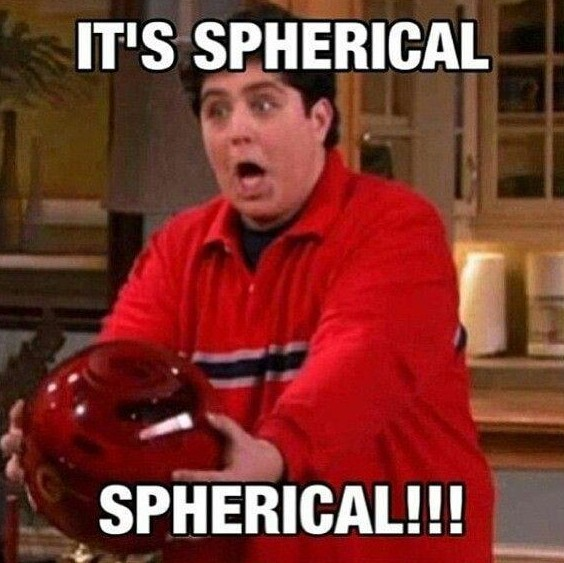
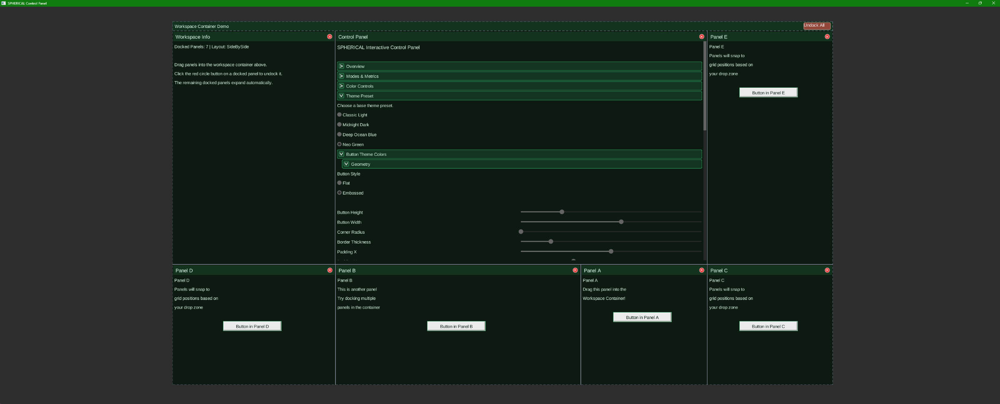

<h1 align="center">SPHERICAL</h1>
<h3 align="center">-- A GUI LIBRARY / SDK --</h3>

<p align="center">
  <a href="https://www.youtube.com/watch?v=grtEt0Cudt8">
    
  </a>
</p>

**SPHERICAL** is a C++ GUI SDK prototype focused on building fast, responsive, desktop-style tooling UIs on top of **Vulkan 1.4 dynamic rendering**.
> **Current Release** (Test Control Panel APP Only, **No SDK Library release yet**): [SPHERICAL_Test_Release_v0.2.1-alpha.zip](https://github.com/coolsmek/SPHERICAL/releases/tag/v0.1.13-alpha)

---

--- 

Dev screenshots:
<p align="center">
    
</p>

---

---

### If you want to use SPHERICAL and build from source, here are some additional notes:

#### Getting Nuklear (Submodule)

#### Dependencies

This project uses the [Nuklear](https://github.com/immediate-mode-ui/nuklear) immediate-mode GUI library, which is included as a Git submodule located in `SPHERICAL-SDK/third_party/Nuklear`.

### Cloning for the first time
To clone this repository along with the Nuklear submodule, use the `--recursive` flag:

```
git clone --recursive https://github.com/coolsmek/SPHERICAL.git
```
#### ALSO:
- SPHERICAL uses vcpkg to manage its dependencies. See vcpkg.json for more info.
- SPHERICAL uses CMake to manage its build.
- this repo includes font Arimo-Regular.ttf for use with the SPHERICAL_Test app. see SPHEREICAL-TEST/fonts/LICENSE.txt for license details.

---

At its core, the project combines:

- **Vulkan** for explicit GPU control and low-latency presentation
- **SDL3** for windowing, platform integration, and input events
- **Nuklear** for immediate-mode UI construction
- **FreeType + msdfgen** for baked grayscale and MSDF font atlases

The current milestone is an interactive demo app that proves the end-to-end pipeline: window creation, Vulkan initialization, Nuklear UI generation, font atlas upload, command conversion, and on-screen rendering of an actual control panel.

---

## Vision

SPHERICAL is aiming to be a functional GUI SDK for desktop applications, focusing on Game Development and Tooling 
environments integrating 3D viewport and user interaction. <- the latter is a stretch goal, but the former is the primary target.

The long-term goal is a **tooling-oriented GUI SDK** for applications that care about:

- **very low input latency**
- **stable frame pacing**
- **predictable rendering**
- **high-quality text**
- **desktop-tool ergonomics**

The project is intentionally shaped around the needs of editor-style software:

- control panels
- command palettes
- high-frequency interaction
- responsive sliders / buttons / text fields
- eventual background task orchestration without blocking the UI loop

In short: SPHERICAL is trying to be a foundation for **native-feeling, GPU-driven desktop tools** rather than a game HUD or a web wrapper.

---

## Project Goals

### Near-term goals

- Render a working immediate-mode GUI through Vulkan dynamic rendering
- Support text, panels, sliders, buttons, and text input cleanly
- Keep UI interaction responsive within the same rendered frame
- Provide a simple SDK-facing interface through `Spherical::Init`, `NewFrame`, `Render`, and `Shutdown`

### Medium-term goals

- Add a **task runner** for non-blocking background work
- Add a **command palette** (`Ctrl+P`-style workflow)
- Improve interaction polish, including **hover fade animation**
- Tighten swapchain/runtime behavior and validation robustness

### Longer-term goals

- Continue refining **Grayscale / MSDF-quality** text rendering and DPI behavior
- Improve high-DPI behavior and scaling quality
- Expand the SDK from a working prototype into a more reusable editor/toolkit foundation

---

---

## Tech Stack

### Language / Build

- **C++**
- **CMake**
- **vcpkg** for dependency management

### Rendering / Windowing / UI

- **Vulkan 1.4**
  - dynamic rendering
  - explicit swapchain / synchronization management
- **SDL3**
  - native window creation
  - Vulkan surface integration
  - input/event collection
- **Nuklear**
  - immediate-mode UI authoring
  - draw command generation
- **FreeType**
  - hinted grayscale glyph rasterization
  - baseline font metrics / atlas generation for UI text
- **msdfgen**
  - multi-channel signed distance field generation for scalable text

### Additional libraries

- **GLM**

---

## Why Vulkan + Nuklear?

This project is intentionally opinionated.

### Why Vulkan?

Because the SDK wants explicit control over:

- presentation behavior
- synchronization
- dynamic rendering setup
- GPU buffer ownership
- low-latency frame submission

That makes it a good fit for tooling UIs where interaction quality matters and hidden abstraction cost is undesirable.

### Why Nuklear?

Because Nuklear provides:

- a compact immediate-mode UI model
- a small, understandable surface area
- direct access to draw commands and vertex buffer output
- a workflow that maps well onto a custom renderer

SPHERICAL treats Nuklear as the **UI authoring layer**, while Vulkan remains the **rendering execution layer**.

---

## Architecture Overview

The project is currently organized around a small set of focused modules.

### Application-Level vs. SDK-Level Separation

SPHERICAL enforces a **clean separation of concerns** between application code and graphics infrastructure:

#### Application Level (`SPHERICAL-TEST/main.cpp`)
- Defines **what UI should be displayed** (windows, controls, layout, state management)
- Uses **Vulkan-free, Nuklear-free API** via `Spherical::UIPainter`
- Implements a **UI build callback** registered with `Spherical::RegisterUI(callback)`
- Owns all **UI state** (slider values, text buffers, button flags, etc.)

Example:
```cpp
Spherical::RegisterUI([](Spherical::UIPainter& ui) {
    if (ui.begin_panel("My Panel", 20, 20, 300, 400)) {
        ui.label("Hello, World!");
        if (ui.button("Click Me")) { /* handle click */ }
        ui.slider_float("Value:", &myVar, 0.0f, 1.0f, 0.01f);
    }
    ui.end_panel();
});
```

#### SDK Level (`SPHERICAL-SDK`)
- Takes the **application's UI definitions** and translates them to **Nuklear + Vulkan**
- Manages **all Vulkan infrastructure** (instance, device, swapchain, command buffers, synchronization)
- Owns **immediate-mode UI rendering** and vertex buffer conversion
- Provides a clean lifecycle API: `Init()`, `NewFrame()`, `Render()`, `Shutdown()`

This separation means:
- ✅ **Apps never touch Vulkan or Nuklear** — they describe UI only
- ✅ **SDK owns graphics complexity** — implementation details are hidden
- ✅ **Future flexibility** — the SDK could swap Vulkan for DirectX/Metal/OpenGL without app changes
- ✅ **Reusability** — any app can use Spherical SDK for its UI, regardless of domain

### `SPHERICAL.h` Public API

The public lifecycle and UI entry points:

- `Spherical::Init(SphericalInitInfo)` — Initialize the SDK with a window
- `Spherical::NewFrame()` — Update input state from OS events
- `Spherical::Render()` — Render (SDK handles Vulkan acquire/record/submit/present internally)
- `Spherical::Shutdown()` — Cleanup
- **`Spherical::RegisterUI(UIBuildFn callback)`** — Register the app's UI definition callback
- `Spherical::UIPainter` — Abstract interface for UI authoring (labels, sliders, buttons, collapsible subsections, etc.)

### Using the Declarative UI API

Applications register a single UI build callback before calling `Spherical::Init()`. The callback is invoked every frame with a `UIPainter` object. Methods on the painter correspond to Nuklear widget calls, but apps never see Nuklear:

```cpp
Spherical::RegisterUI([](Spherical::UIPainter& ui) {
    if (ui.begin_panel("Control Panel", 20, 20, 350, 550)) {
        if (ui.begin_panel_subsection("Status")) {
            ui.label("Status: Ready");
        }
        ui.end_panel_subsection();

        if (ui.begin_panel_subsection("Controls")) {
            ui.slider_float("Intensity:", &intensity, 0.0f, 1.0f, 0.01f);

            if (ui.begin_panel_subsection("Advanced")) {
                ui.text_input("Search:", searchBuffer, sizeof(searchBuffer));
            }
            ui.end_panel_subsection();

            if (ui.button("Apply")) {
                ApplySettings();
            }
        }
        ui.end_panel_subsection();
    }
    ui.end_panel();
});

Spherical::Init(initInfo);
```

`begin_panel_subsection()` headers render with a title and chevron-style expand/collapse button. Subsections default to expanded the first time they appear and preserve their expansion state across frames.

---

## Render Flow

### Current app-facing flow

1. Host app runs window/app loop
2. Host app calls `Spherical::NewFrame()`
3. Host app calls `Spherical::Render()`
4. SDK handles Vulkan acquire/record/submit/present for UI rendering

Conceptually:

```cpp
while (running) {
    Spherical::NewFrame();
    Spherical::Render();
}
```

---

## Demo App

The current demo exists to prove the SDK is not just initializing, but actually usable.

### What it demonstrates

- Vulkan window-to-screen rendering
- Nuklear panel rendering
- live text rendering through the baked atlas
- interactive controls
- real-time UI state updates

### Current UI elements

- Control Panel window
- FPS display
- mouse position display
- RGB sliders
- live color readout
- button + click counter
- text input field
- echoed captured string

This demo is the current reference implementation for how the SDK is expected to be integrated.

---

## Repository Layout

```text
SPHERICAL/
├─ images/
├─ SPHERICAL-SDK/
│  ├─ include/
│  ├─ shaders/
│  ├─ src/
│  └─ third_party/Nuklear    <-- submodule https://github.com/immediate-mode-ui/nuklear
├─ SPHERICAL-TEST/
│  ├─ fonts/
│  └─ main.cpp
├─ cmake/
├─ CMakeLists.txt
└─ build_all.bat
```

---

## Building

### Requirements

You will need:

- a C++ toolchain supported by CMake
- Vulkan SDK / loader available through your environment or package setup
- `vcpkg` dependencies available for this project
- CMake on `PATH`

### Recommended build (default: build only)

```powershell
cmake --preset vs2022-debug
cmake --build --preset build-debug-all
```

### Build and run the demo explicitly

```powershell
cmake --preset vs2022-debug
cmake --build --preset build-debug-test
.\out\build\vs2022-debug\SPHERICAL-TEST\Debug\SPHERICAL_Test.exe
```

### Manual CMake build

```powershell
cmake --preset vs2022-release
cmake --build --preset build-release-sdk
cmake --build --preset build-release-test
```

### Run the demo directly

```powershell
.\out\build\vs2022-debug\SPHERICAL-TEST\Debug\SPHERICAL_Test.exe
```

### Available presets

- `vs2022-debug` / `vs2022-release`: configure the full workspace for Visual Studio 2022 x64.
- `build-debug-all` / `build-release-all`: build the entire solution.
- `build-debug-sdk` / `build-release-sdk`: build only the `Spherical` SDK target.
- `build-debug-test` / `build-release-test`: build only the `SPHERICAL_Test` app.

---

## Runtime Notes

- The demo bundles its font assets into the runtime output folder.
- The current text path supports two baked atlas modes: **Grayscale** for hinted small UI text and **MSDF** for scalable distance-field text.
- Explorer / double-click launch is supported by resolving font assets relative to the executable output.